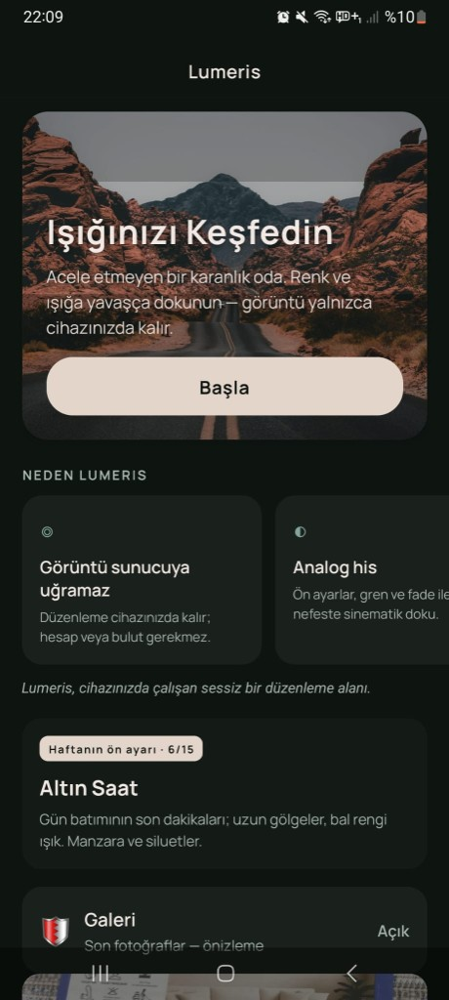
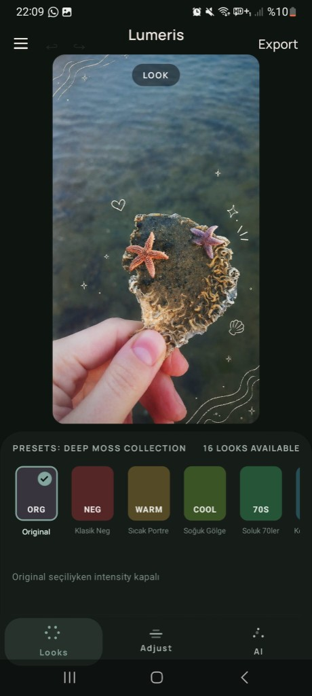
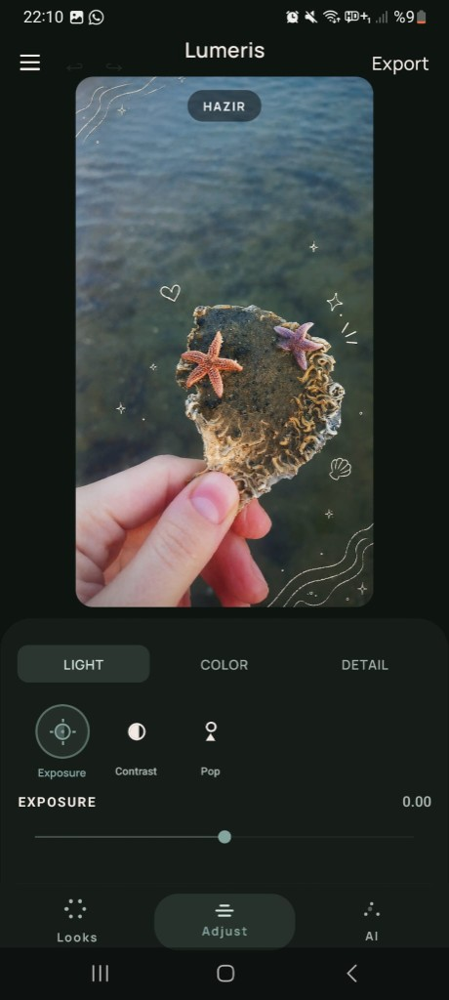
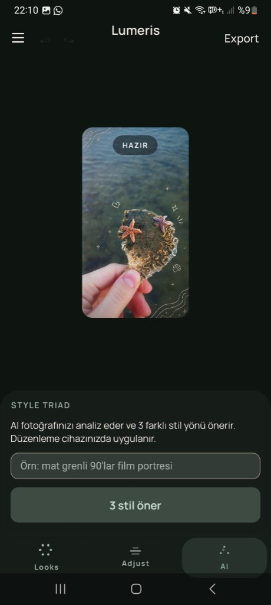
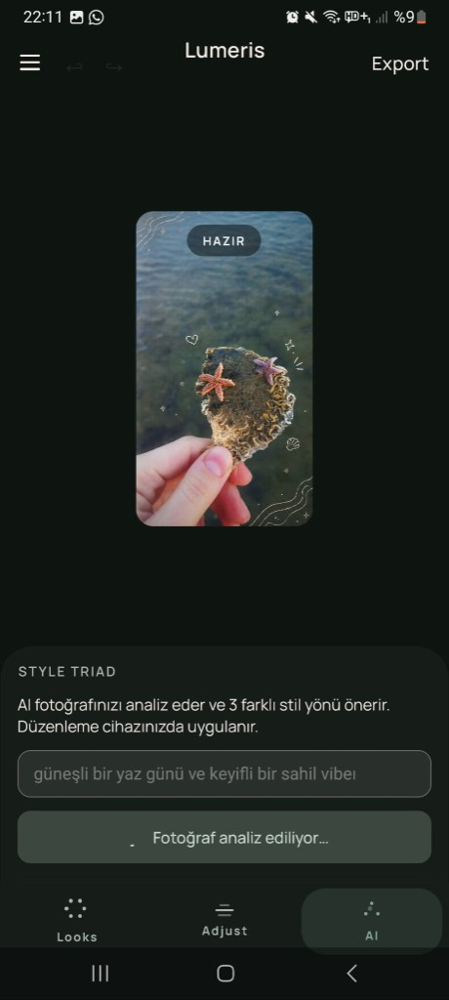
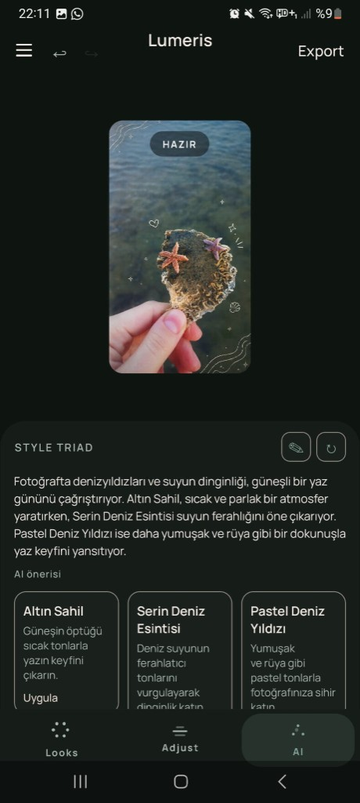
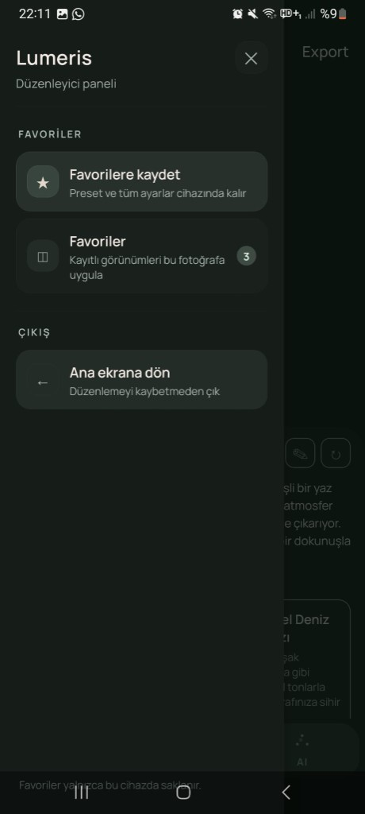
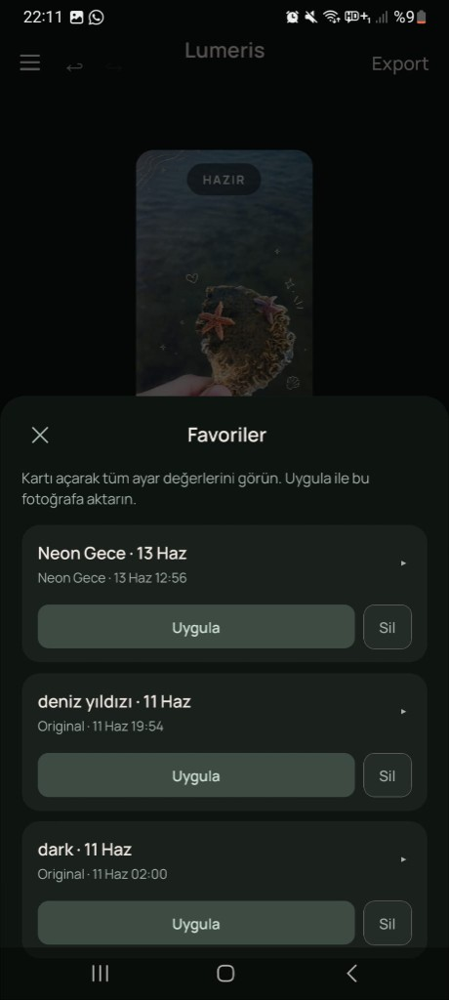
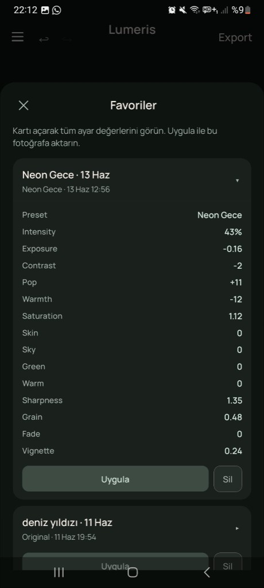
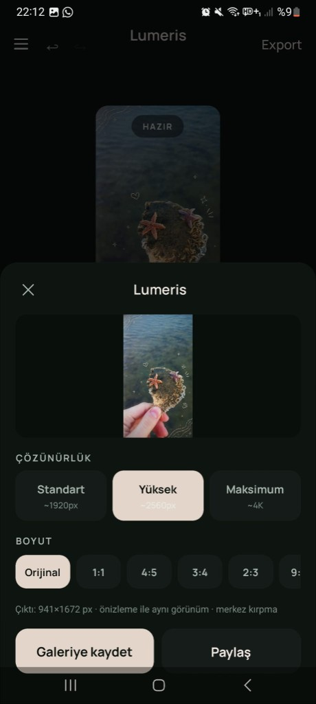

# Lumeris

On-device analog fotoğraf editörü + **Style Triad** (AI ile üç stil önerisi). Kayıt yok, reklam yok; düzenleme cihazınızda kalır.

| | |
|---|---|
| **Web (Vercel)** | [https://app-preneur301.vercel.app/](https://app-preneur301.vercel.app/) |
| **Backend (Render)** | [https://lumeris-api.onrender.com](https://lumeris-api.onrender.com) |
| **Belgeler** | [prodocs/](prodocs/) — PRD, plan, ilerleme |

---

## Uygulama

Lumeris, acele etmeyen bir karanlık oda gibi düşünülebilecek bir mobil editör. Hazır analog görünümler (Looks), ince ayarlar (Adjust) ve isteğe bağlı AI stil koçu (Style Triad) aynı akışta bir arada.

### Karşılama

Galeriden hızlı başlangıç, haftanın ön ayarı ve “görüntü sunucuya uğramaz” vurgusu tek ekranda toplanır.

<p align="center">
  
</p>

*Işığınızı keşfedin — renk ve ışığa yavaşça dokunun; görüntü yalnızca cihazınızda kalır.*

---

### Looks & Adjust

**Looks:** 16 hazır analog ön ayar (Deep Moss Collection); tek dokunuşla görünüm, yoğunluk slider’ı (Original hariç). Basılı tutunca önce/sonra karşılaştırma.

**Adjust:** Işık, renk ve detay alt sekmeleri — pozlama, kontrast, pop, sıcaklık, doygunluk, keskinlik, grain, fade, vignette gibi manuel kontroller.

<p align="center">
  
  &nbsp;&nbsp;
  
</p>

*Solda preset galerisi, sağda Işık / Renk / Detay grupları altında slider’lar.*

---

### Style Triad (AI)

Kısa bir metin yazın (ör. *“güneşli bir yaz günü, keyifli sahil vibe’ı”*); AI fotoğrafı analiz eder ve **üç farklı stil yönü** önerir. Birine dokunduğunuzda düzenleme **cihazda** Skia pipeline’a uygulanır. Tam dosya sunucuya gitmez — yalnızca onay verdiğiniz küçük önizleme API’ye gider.

<p align="center">
  
  &nbsp;
  
  &nbsp;
  
</p>

*Sorgu → analiz → Altın Sahil, Serin Deniz Esintisi, Pastel Deniz Yıldızı gibi üç kart; tek dokunuşla uygula.*

---

### Favoriler (kayıtlı tarifler)

Beğendiğiniz tüm ayarları cihazda tarif olarak saklayın; başka fotoğrafa tek dokunuşla uygulayın.

<p align="center">
  
  &nbsp;
  
  &nbsp;
  
</p>

*Menüden kaydet / listele / ana ekrana dön — kartı açınca preset, intensity, exposure, grain vb. tüm değerler görünür.*

---

### Export

Önizleme ile aynı görünüm (WYSIWYG); çözünürlük ve en-boy oranı seçimi; galeriye kaydet veya paylaş.

<p align="center">
  
</p>

*Standart / Yüksek / Maksimum çözünürlük; Orijinal, 1:1, 4:5, 9:16 gibi kırpma preset’leri.*

---

## Teknik detaylar

### Mimari

```
app_preneur_301/
├── frontend/          # Expo SDK 54 + React Native + Skia (on-device render)
├── backend/           # FastAPI — meta, experience, Style Triad API
├── prodocs/           # PRD, plan, progress
├── docs/screenshots/  # README görselleri
└── render.yaml        # Backend deploy (Render)
```

| Katman | Teknoloji | Rol |
|--------|-----------|-----|
| İstemci | Expo 54, RN, TypeScript, **react-native-skia** | GPU color matrix + SkSL (grain, vignette, fade); galeri, export |
| Backend | **FastAPI**, Python 3.12, **Gemini 2.5 Flash** | `POST /api/v1/suggest-styles`, haftalık vitrin, preset kataloğu |
| Deploy | **Render** (API) + **Vercel** (web) | [lumeris-api.onrender.com](https://lumeris-api.onrender.com) · [app-preneur301.vercel.app](https://app-preneur301.vercel.app/) |

**Gizlilik modeli:** Düzenleme ve export **zero-server** (tam çözünürlük cihazda). Style Triad için **opt-in** küçük thumbnail + kullanıcı onayı ile backend; Gemini yoksa çevrimdışı fallback preset’ler.

### Öne çıkan API uçları

| Metot | Yol | Açıklama |
|--------|-----|----------|
| `GET` | `/health` | Sağlık kontrolü |
| `GET` | `/api/v1/experience` | Karşılama metinleri, haftalık vitrin |
| `GET` | `/api/v1/presets` | Preset kataloğu |
| `POST` | `/api/v1/suggest-styles` | Style Triad (Gemini + fallback) |

OpenAPI: [https://lumeris-api.onrender.com/docs](https://lumeris-api.onrender.com/docs)

### Ortam değişkenleri

Kök şablon: [`.env.example`](.env.example) — kopyalayın:

- `backend/.env` — `GEMINI_API_KEY`, `GEMINI_MODEL`, `PORT`, …
- `frontend/.env` — `EXPO_PUBLIC_LUMERIS_API_BASE_URL=https://lumeris-api.onrender.com`

Ayrıntı: [`backend/.env.example`](backend/.env.example), [`frontend/.env.example`](frontend/.env.example)

### Yerel çalıştırma

**Backend:**
```powershell
cd backend
py -m uv sync
py -m uv run uvicorn app.main:app --host 0.0.0.0 --port 3001 --reload
```

**Frontend (Expo Go):**
```powershell
cd frontend
npm install
npx expo start
```

**Demo APK (Metro gerekmez — release):**
```powershell
cd frontend
npm run apk:demo
```
Çıktı: `frontend/android/app/build/outputs/apk/release/app-release.apk`

> Debug APK (`app-debug.apk`) Metro bekler; demo için **release** kullanın.

### Kaynak belgeler

- [prodocs/app_prd.md](prodocs/app_prd.md) — ürün gereksinimleri  
- [prodocs/plan.md](prodocs/plan.md) — faz planı  
- [prodocs/progress.md](prodocs/progress.md) — geliştirme günlüğü  
- [prodocs/TECH_FOUNDATION.md](prodocs/TECH_FOUNDATION.md) — teknik temel  

---

*Lumeris — analog his, cihazda işler, AI isteğe bağlı.*
